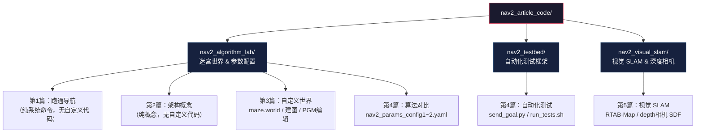

# Nav2 仿真测试代码仓库

本仓库是知乎专栏《入门 Nav2》系列文章的配套代码和配置文件。

> 技术栈：ROS2 Humble + Gazebo Classic 11 + Nav2 1.1 + TurtleBot3 waffle + RTAB-Map

---

## 前置要求

### 环境安装

Ubuntu 22.04 + ROS2 Humble 桌面版已安装的前提下，执行：

```bash
sudo apt install ros-humble-navigation2 ros-humble-turtlebot3 \
    ros-humble-gazebo-ros-pkgs ros-humble-slam-toolbox
```

第五篇（视觉 SLAM）需要额外安装：

```bash
sudo apt install ros-humble-rtabmap-ros ros-humble-rtabmap
```

### 环境变量

在 `~/.bashrc` 中添加：

```bash
source /opt/ros/humble/setup.bash
export TURTLEBOT3_MODEL=waffle
export GAZEBO_MODEL_PATH=$GAZEBO_MODEL_PATH:/opt/ros/humble/share/turtlebot3_gazebo/models
```

### Gazebo 模型预下载

首次启动 Gazebo 会自动下载模型，可能会卡住数分钟。建议提前下载：

```bash
mkdir -p ~/.gazebo/models
git clone https://github.com/osrf/gazebo_models.git ~/.gazebo/models/
```

---

## 目录结构



### 子目录说明

| 目录 | 包含内容 | 对应文章 |
|------|---------|---------|
| `nav2_algorithm_lab/` | 迷宫世界 (`.world`)、SLAM 建图结果、5 种 Nav2 参数配置、动态障碍物脚本 | 第1-4篇 |
| `nav2_testbed/` | 参数化启动入口、4 种算法组合配置、批量测试脚本 | 第4篇 |
| `nav2_visual_slam/` | 深度相机 SDF 模型、RTAB-Map 启动与定位 launch、RViz 配置 | 第5篇 |

---

## 快速使用

```bash
# 第3篇：启动迷宫世界
ros2 launch $HOME/nav2_article_code/nav2_algorithm_lab/launch/maze_simulation_launch.py

# 第4篇：切换算法配置跑迷宫
ros2 launch $HOME/nav2_article_code/nav2_testbed/launch/testbed.launch.py \
    world:=$HOME/nav2_article_code/nav2_testbed/worlds/maze.world \
    map:=$HOME/nav2_article_code/nav2_testbed/maps/maze.yaml \
    params:=$HOME/nav2_article_code/nav2_testbed/params/smac_rpp.yaml

# 第5篇：启动 RTAB-Map 视觉 SLAM（融合模式）
ros2 launch $HOME/nav2_article_code/nav2_visual_slam/launch/visual_slam_launch.py
```

> 每次启动前先执行对应的 `cleanup.sh` 清理残留进程。

---

## 系列文章目录

| 篇号 | 标题 | 难度 | 核心内容 | 依赖目录 | 知乎链接 |
|------|------|------|---------|---------|---------|
| 1 | 30 分钟跑通自主导航与 SLAM 建图 | ★☆☆☆☆ | 环境搭建、启动仿真、首次导航、SLAM 建图 | — | |
| 2 | 理解 TF 变换树、代价地图与导航服务器架构 | ★★☆☆☆ | REP-105 TF 树、Costmap 分层、Nav2 服务器管道 | — |https://zhuanlan.zhihu.com/p/2049881249595102605|
| 3 | 自定义仿真世界与 SLAM 建图 | ★★★☆☆ | 手写 SDF 世界文件、迷宫 SLAM、PGM 编辑 | `nav2_algorithm_lab` | |
| 4 | 算法对比与自动化测试 | ★★★☆☆ | 4 种 Planner×Controller 对比、send_goal + run_tests 框架 | `nav2_algorithm_lab` + `nav2_testbed` | |
| 5 | 视觉 SLAM 入门——RTAB-Map + Nav2 仿真导航 | ★★★★☆ | 深度相机改造、RTAB-Map 配置、三种模式对比 | `nav2_visual_slam` | |

---

## 许可证

Copyright 2026 Nav2 仿真测试

Licensed under the Apache License, Version 2.0 (the "License");
you may not use this file except in compliance with the License.
You may obtain a copy of the License at

    http://www.apache.org/licenses/LICENSE-2.0

Unless required by applicable law or agreed to in writing, software
distributed under the License is distributed on an "AS IS" BASIS,
WITHOUT WARRANTIES OR CONDITIONS OF ANY KIND, either express or implied.
See the License for the specific language governing permissions and
limitations under the License.
